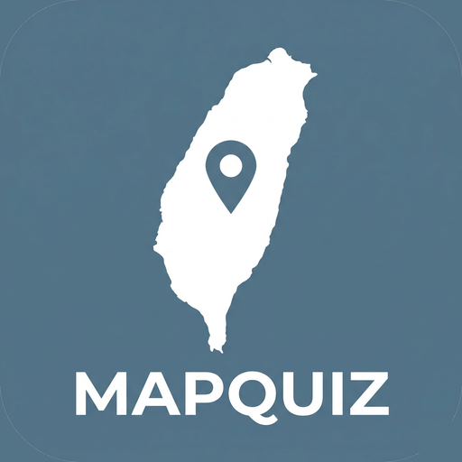

<div align="center">
  
  <h1>MapQuiz（台灣及世界地圖測驗）</h1>
  <p>互動式地理測驗：台灣 22 縣市、368 鄉鎮市區，以及世界 196 國。台灣為主、世界為輔。</p>
  <p><em>北歐極簡風 · 純前端 · 零後端</em></p>
</div>

---

## 簡介

打開就能玩的地理練習網頁，三種模式：看地圖選名字、看名字點地圖、自由練習。縣市與分區兩個層級——分區可選一個縣市放大，單獨考它底下的鄉鎮市區。

成績、最佳連擊、最常答錯的縣市都存在瀏覽器，下次打開還在。地圖是真實界線（縣市取自 g0v、鄉鎮市區取自內政部現行界線），金門與馬祖（連江）放在左上角小框，可 +/− 放大方便點選小區域。

特色：

- **世界國家**：196 國＝193 聯合國會員＋梵蒂岡＋巴勒斯坦＋台灣；**太平洋置中投影（台灣居中）**；看地圖選名字／地標題**緊聚焦目標國**、看名字點地圖聚焦到洲、選項不跨洲；**可先選洲再作答**（全部／六大洲）；地圖支援**滑鼠滾輪快速縮放**（世界題可一路縮小看更大範圍）；微型國有點擊範圍、可放大至 4×
- **世界地標題**：「艾菲爾鐵塔位於哪個國家？」四選一，183 個世界地標（不收跨國界地標避免爭議）
- **景點題**：「日月潭位於哪個縣市？」四選一，121 個代表景點（每縣市 5–6 個），答完地圖點亮正解
- **可中途結算**：測驗下方「停止測驗並結算」，按下立刻以已作答題目結算分數；頂列「‹ 離開」則是放棄不計分
- **計分**：答對 +100（連擊 3/6/10 有 ×1.5/×2/×3 倍率）、答錯 −50（總分不低於 0）、每題 8 秒內答得越快額外加成越多（最高 +50）
- 答對／答錯音效（WebAudio，可靜音）、分數浮動動畫
- 結算評級 S+／S／A／B／C／D，並用對錯把整張地圖上色
- **北歐霧藍極簡介面**，沉穩低干擾
- 純 HTML + CSS + 原生 JS，無框架、無 build step，雙擊 `index.html` 就能跑

## 啟動

```bash
# 方式一：本機預覽（推薦）
python -m http.server 8000
# 開 http://localhost:8000

# 方式二：直接雙擊 index.html
# macOS:  open index.html
# Windows: start index.html
```

不需要 `npm install`，沒有編譯步驟。

## 部署（GitHub Pages）

1. 用 Git Pusher 把專案推上 GitHub（`main` 分支）
2. repo → Settings → Pages → Source：Deploy from a branch → `main`
3. 等 1–2 分鐘，連結出現在 Settings → Pages

純靜態、由 Pages 直接託管 `main` 分支，無 build step。

## 目錄結構

```
MapQuiz/
├── index.html              入口（含 favicon 套組、meta）
├── css/style.css           樣式（CSS 變數：北歐霧藍主題 + SELA 品牌色）
├── data/
│   ├── landmarks.json      景點題編輯來源
│   ├── landmarks.js        景點題載入檔（window.LANDMARKS）
│   ├── world.js            世界國界資料：196 國（V1.0.0 已接線）
│   ├── world-landmarks.json 世界地標題編輯來源
│   ├── world-landmarks.js  世界地標題載入檔（window.WORLD_LANDMARKS）
│   └── world_names.txt     196 國繁中名單（供校對）
├── js/
│   ├── data.js             地圖資料（window.MAP / window.DISTRICTS）
│   └── app.js              主程式（測驗流程、計分、音效、存檔）
├── favicon/                favicon／app icon 套組（MapQuiz app logo）
├── assets/app-logo.png     app 主視覺（README／首頁）
├── assets/sela.svg         SELA 品牌標識（歸屬印記）
├── SELA-logo-prompt.md     app logo 生成 prompt（給其他 AI 生圖）
├── README.md
├── CLAUDE.md
├── SELA-handoff.md
└── .gitignore
```

## Logo

app 專屬 logo（V1.0.0 起換為「地圖書＋羅盤＋定位 pin」版本，呼應世界地圖；霧藍底 #3C6078）已整合為 favicon／app icon／README 主視覺，由其他 AI 生圖、Claude 優化轉檔（多解析度 + favicon.ico + apple-touch-icon）。`SELA-logo-prompt.md` 保留生成用的 prompt。SELA logo 作為品牌歸屬印記，置於首頁底與 README footer。

## 資料來源

- 縣市界線：g0v/twgeojson（桃園已更名為桃園市）
- 鄉鎮市區界線：內政部「鄉鎮市區界線」現行版，經 dkaoster/taiwan-atlas 轉 TopoJSON
- 界線於建置期以 Python 簡化、投影、外島做 inset，輸出成輕量 SVG 路徑

## 版本

V1.4.0

---

<div align="center">
  
  <br/>
  <sub>Made by <strong>SELA</strong> · V1.4.0</sub>
</div>
